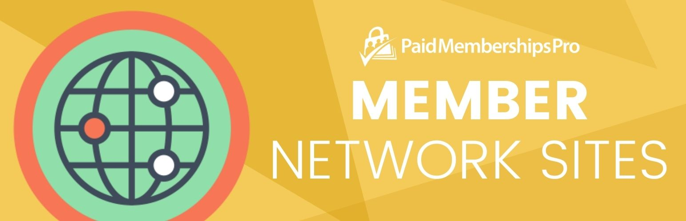

# [Paid Memberships Pro - Member Network Sites](https://www.paidmembershipspro.com/add-ons/pmpro-network-multisite-membership/) #
[comment]: # (Generate badges from shields.io, only works for .org plugins to get other stats etc. We'd have to create our own endpoints for Premium plugins)

### Welcome to the Paid Memberships Pro - Member Network Sites GitHub Repository

Create a network site for the member as part of membership to the main site.

Allow a member to purchase one or more sites as part of membership. Once configured, the member can purchase membership at the network’s main site (the primary domain of the network) and specify the “Site Name” and “Site Title” for their new site on the network.

Any sites attached to a member will be deactivated when membership expires or cancels.

For more information please visit [the Add On documentation page for this plugin](https://www.paidmembershipspro.com/add-ons/pmpro-network-multisite-membership/).

## Installation ##
For detailed installation steps, visit the [documentation](https://www.paidmembershipspro.com/add-ons/pmpro-network-multisite-membership/) page.

1. Download the current development ZIP file directly: `https://github.com/strangerstudios/pmpro-network/archive/dev.zip`

**Please ensure that once installing this version of the plugin to remove `-dev` from the plugin's folder name.**

## Bugs ##
If you find an issue/bug, let us know by [creating a detailed GitHub issue](https://github.com/strangerstudios/pmpro-network/issues/new/choose).

## Support ##
This is a developer's portal for Paid Memberships Pro - Member Network Sites. We do not offer support on this channel. **Any support related questions should be directed to [our website](https://www.paidmembershipspro.com/add-ons/pmpro-network-multisite-membership/).**

## Contributing to Paid Memberships Pro - Member Network Sites ##
We encourage and welcome any contribution to Paid Memberships Pro - Member Network Sites. Please read the [guidelines for contributing](https://github.com/strangerstudios/pmpro-network/blob/dev/.github/CONTRIBUTING.md) to this repository.

There are various **ways to the help development** of Paid Memberships Pro - Member Network Sites:

1. Report [bugs/issues](https://github.com/strangerstudios/pmpro-network/issues/new/choose) on GitHub.
2. Work on any issues by submitting a Pull Request.

Here are some ways for **non-developers to contribute** to Paid Memberships Pro - Member Network Sites:

1. Translate Paid Memberships Pro - Member Network Sites into your own [language](https://www.paidmembershipspro.com/paid-memberships-pro-in-your-language/).
2. [Purchase a Plus membership](https://paidmembershipspro.com/pricing) to help fund ongoing development and bug fixes.
